# The Business of Life: Applying BI Tools & Techniques to Achieve Personal Goals

NW Missouri CSIC 44632 "Custom BI" Final Submission Project - Data Journal

- Author: Aaron Gillespie  
- Date: 2025-04-20

> [!NOTE]
> A somewhat tongue-in-cheek project utilizing business intelligence tools against **12 years of quantified self data** to determine, once and for all, what constitutes a successful life & build a dashboard to support it going forward. Compiled for fun, but also as part of Northwest Missouri's CSIS 44632 Final. 

This repository is being created in service of Northwest Missouri State University 44632 Module 7 - Exploratory Data Analysis. It will accomplish the following objectives from the module:

- demonstrate skills with Jupyter, pandas, Seaborn and popular tools for data analytics
- tell a data story and visually present findings in a clear and engaging manner

And, in my case, will include one additional objective:
- Utilizing my long-running quantified self project / data journal for an grad school assignment

## Section 1. The Business Goal

I am not a business, but I am a very goal-oriented person who's experienced in the way that businesses set and measure goals. I've my own Objectives and Key Results, I have my own Key Performance Indicators. I've built a system of tools supporting these goals, while also generally making note of events and happenings in my life. More on that later. **I want to know if I'm on track to meet these goals**.

### My goals for 2025 are:

- To improve my health
  - leading indicators
    - move my bed & wake times toward 11:00pm and 7:00am
    - work out 183 times, balancing 1/2 strength, 1/3 cardio, & 1/6 mobility
    - eat out fewer than 156 times
    - drink fewer than 156 non-water/coffee/tea drinks
  - lagging indicators
    - improved results in [my generalized fitness test](https://aarongilly.com/Columns/379)
    - maintained or improved biometric test results (i.e. bloodwork)
    - fewer tracked `pains` & `treatments`
- To maintain my rate of content consumption
  - read 20 books
  - watch 36 (new) movies
  - play 3 (new) videogames
  - watch TV around 75 times
- To maintain my rate of content creation
  - write 18 [blog posts](https://aarongilly.com/467)
  - add 300 notes to [my public-facing body of notes](https://gillespedia.com)
  - record 12 [podcast episodes](https://shows.acast.com/we-scene-a-movie)
  - create 1 [puzzle box](https://aaronspuzzles.com)
- To partake in more of what gives life meaning
  - see friends 26 times
  - see family 26 times
  - go on 13 dates
  - see 4 concerts
  - do 13 fun outings of other types (e.g. bowling)

Not every goal up there will be addressed in this project, but most will. I institute time-bound habits, personal rules, etc, and watch how they impact these numbers. In this way I learn what's effective and what's not. 

> [!IMPORTANT]
> My ultimate goal is to try to live an interesting & satisfying life.

## Section 2. Data Source

Data are sourced from a variety of locations. The predominate sources are my [Data Journal](https://aarongilly.com/Pages/Data-Journal) and the data collected from my Oura Ring, but there are others, as illustrated below.

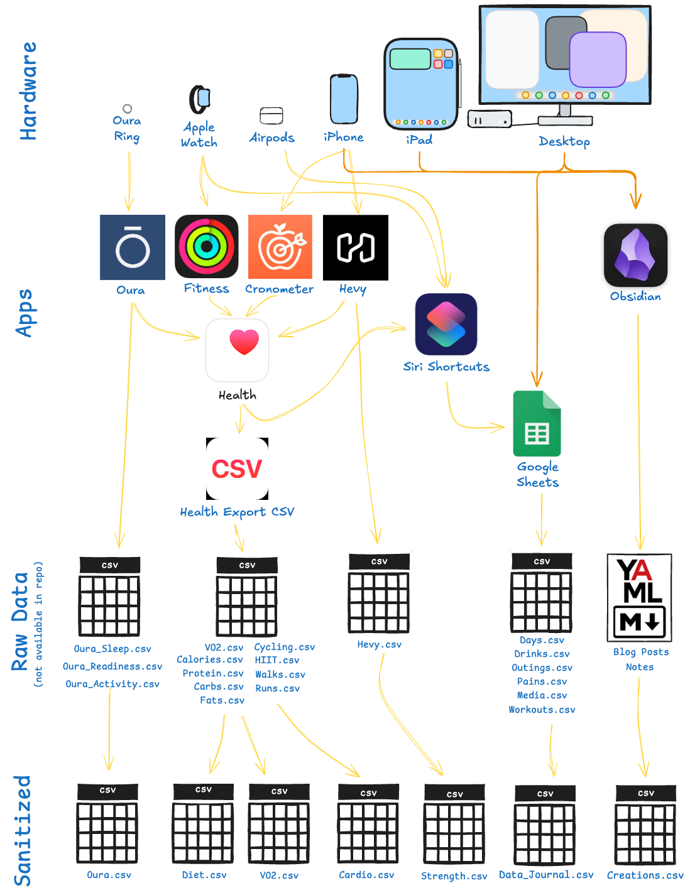

The data have been collected both actively and passively. Some data have **12 years** of history, while others started more recently.

> [!TIP]
> For more information on how the bulk of these data are collected, see [my article on my Data Journal](https://aarongilly.com/Pages/Data-Journal)

## Section 3. Tools Used

Some portion of "tools used" is covered in my graphic above. The mechanics of the Data Journal are covered in the links provided above. The tools used in this project are as follows:

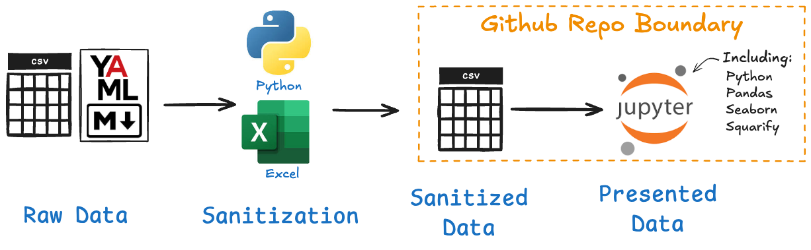

I will **not** be utilizing SQL, nor Spark, as in my experience for the volume of data I'll be working with *(on the order of 1000's of rows)* neither is required. 

## Section 4. Workflow & Logic

This is a required section, but I feel like it's pretty well covered by the above. 

For a taste of the work done I do include `scripts/process_folder_to_csv.py` which created `data/Content.csv`.

What's not covered, perhaps, is the general approach in the Jupyter Notebook. The approach there is:

1. Read CSVs into Pandas DataFrames
2. Utilize Seaborn, Matlibplot, etc to generate visualizations
3. Tweak & caption visuals to tell the story
4. Close with an overall summary

## Section 5. Results (narrative + visualizations)

We are 30.7% of the way through the year.

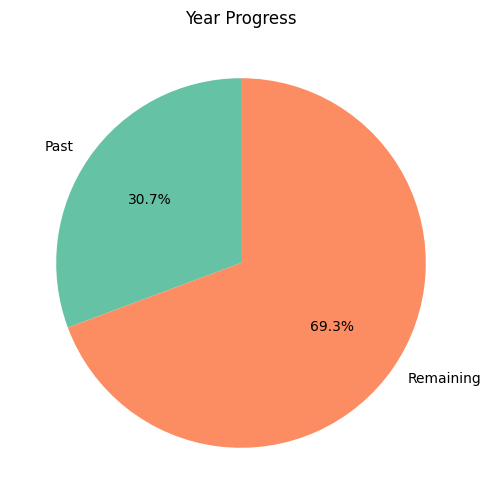

Extrapolating current progress toward cumulative goals would be equivalent to deviding YTD results by 0.307.

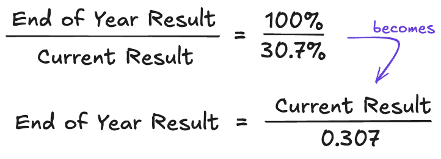

### Health

My health goals are split into leading & lagging indicators, because [leading indicators measure strategy adherence and lagging indicators measure strategy effectiveness](https://gillespedia.com/Leading+indicators+measure+strategy+adherence+and+lagging+indicators+measure+strategy+effectiveness). The leading indicators I'll share here, the lagging indicators I won't.

- 🔴 Move my bed & wake times toward 11:00pm and 7:00am

Progress is negative. 

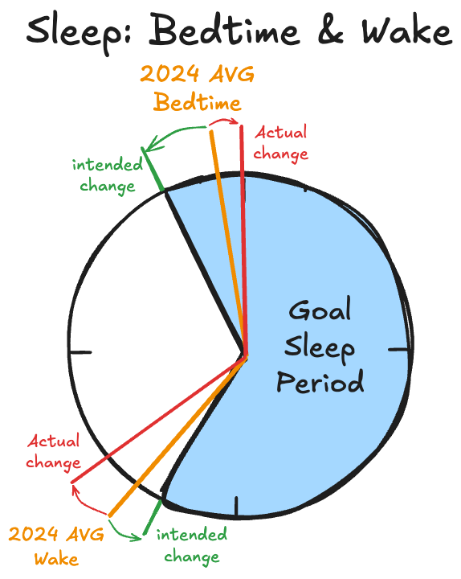

- 🟢 Work out 183 times, balancing 1/2 strength, 1/3 cardio, & 1/6 mobility 

Ahead of pace! **79** workouts YTD. 79 / 0.307 = **257** projected. And the ratio looks good enough to me.

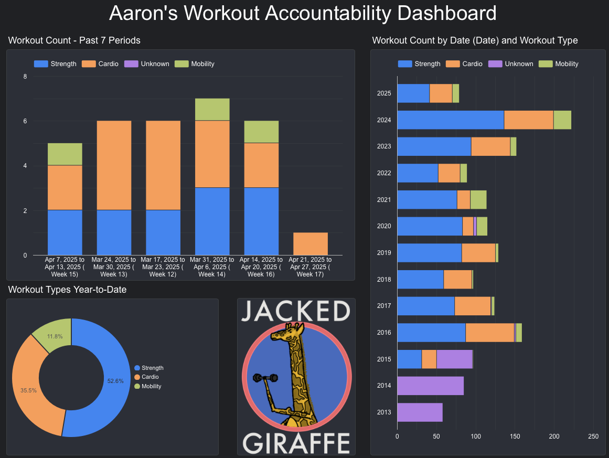

In this case I actually made [an interactive, drillable dashboard](https://lookerstudio.google.com/reporting/6035f948-6b20-4191-85d7-f9a2c4eedfd7/page/6bkHF?s=vOWQuhkzgso) using Google's Looker Studio. That image is a snapshot of it.

- 🟡 Eat out fewer than 156 times
- 🟡 Drink fewer than 156 non-water/coffee/tea drinks

Both of these are heavily at risk.
- Eating out YTD 2025: 54
  - Extrapolates to 54/0.307 = 176 times = **20 more than the goal's limit**
- Drinks YTD: 67
  - Extraplates to 67/0.307 = 218 = **62 more than the goal's limit**

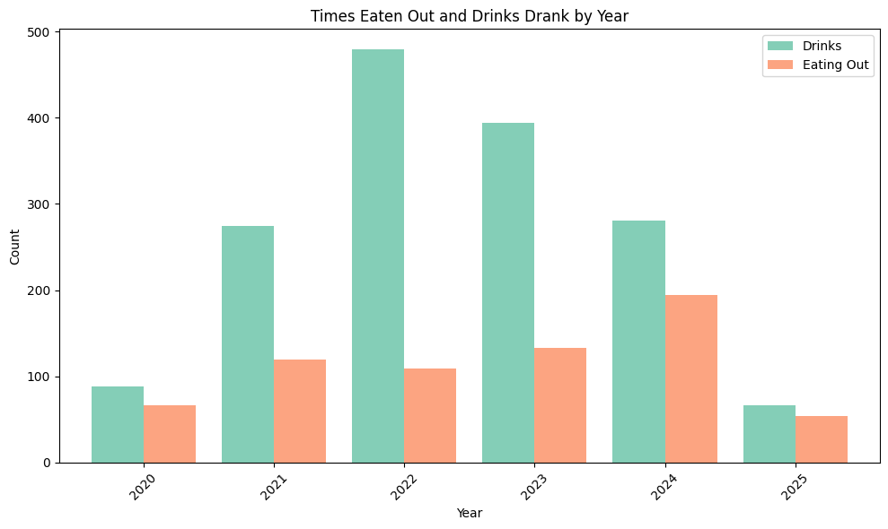

### Content Consumption

This chart below *partly* covers these goals. There are nuances I'll cover below.

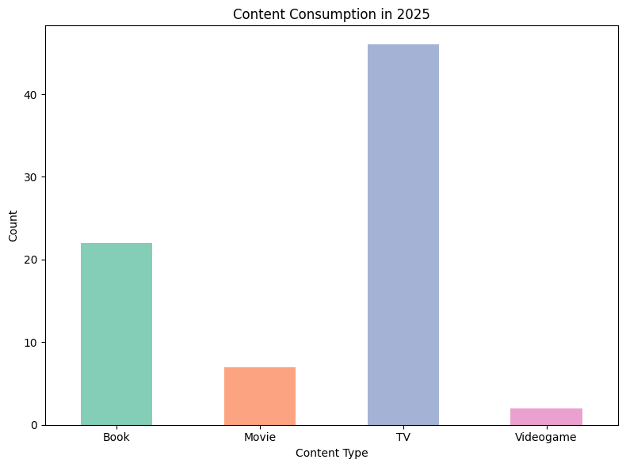

- 🟢 read 20 books
- 🔴 watch 36 (new) movies
- 🟢 play 3 (new) videogames
- 🟡 watch TV around 75 times

Nuances/commentary:

The chart shows book reading *sessions*, not unique books read. That said, I'm at 10 on the year. That's on pace.  It also shows **all** movies watched, not just new ones. That takes me from behind pace to *woefully* behind pace. And my TV viewing goal is soft, but I have definitely watched more TV this year. TV is good right now, so that's okay.

### Content Creation

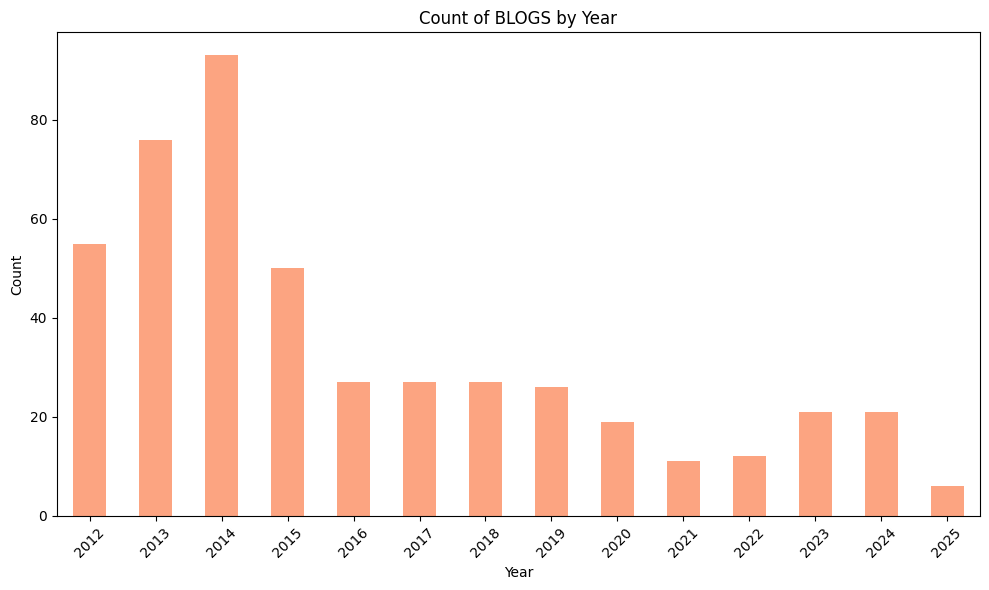

- 🟢 write 18 [blog posts](https://aarongilly.com/467)
  - Currently at 6, projected to 6/0.307 ~= 19 = on pace

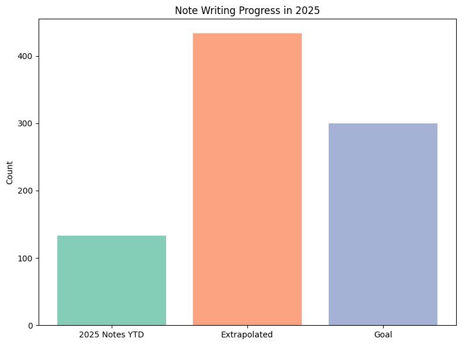

- 🟢 add 300 notes to [my public-facing body of notes](https://gillespedia.com)
  - currently at 133, which is on-pace for 433, this goal may have been too low

Data analysis for these would be unecessary. We've done 3 podcasts and my puzzle box for the year is roughly on pace.

  - 🟢 record 12 [podcast episodes](https://shows.acast.com/we-scene-a-movie)
  - 🟢 create 1 [puzzle box](https://aaronspuzzles.com)

### Outings & Fun

For outings, I've again decided to turn to [Google's Looker Studio](https://lookerstudio.google.com/s/nieFYfFlk7c). 

A snapshot of the dashboard:

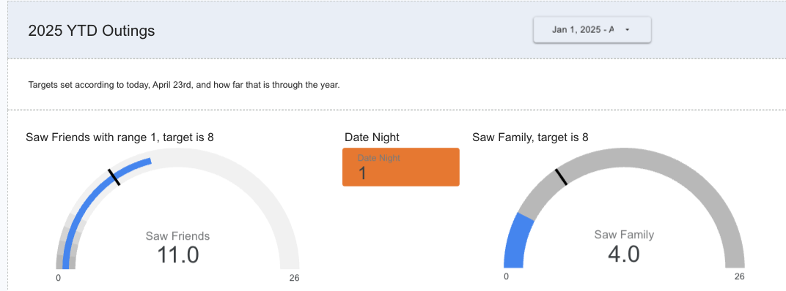

This contains only a subset of the goals for which I had data in the CSV files. I'll go into the source data to provide status on the others.

- 🟢 see friends 26 times
- 🔴 see family 26 times
  - I partly suspect I've missed some instances where this has occurred
- 🔴 go on 13 dates
  - Grad school hasn't helped this one
- 🔴 see 4 concerts
- 🟡 do 13 fun outings of other types (e.g. bowling)

## Section 6. Suggested Business Action

In this analysis I am the business data *analyst*, the business executive, and its primary customer. I'd recommend to myself to expend more energy prioritizing the following activities, all of which are lagging behind the yearly goal:

1. Go see your family and go on some dates.
2. Watch some more movies.
3. Go to sleep earlier.

These arenas are where I'm most in the red. The next on deck would be to eat out a bit less, and slow down on drinking things that aren't water, coffeee, or tea. 

Where I could benefit from **fewer** resources spent (to buy back time/energy for those items above) would be the items I'm *ahead* on. Namely - exercise, writing notes, and reading books. Feels weird to say I should do those things *less*, but too much of a good thing can be a bad thing.

So, more formally:

> [!TIP]
> I suggest slowing exercise down to an every-other-day approach, and use that extra time to go see family and go on dates. Also, look for ways to turn book reading into movie watching!

## Section 7. Challenges

I was challenges in this research and analysis in several ways. My foremost challenge was not feeling like I had the right tool for the job. Frankly this kind of analysis, one-off status checks using datasets numbered in the couple-thousand rows, is where Microsoft Excel and other spreadsheet applications really shines. Creating charts in there is still easier to me than using Jupyter to make charts, even with the super powerful assist from Copilot. I supplemented Jupyter, Python, Pandas, and Seaborn with Google's Looker Studio, which was super enlightening. I created a dashboard that's tied to my real, on-going dataset. I'll use that going forward, but still my analysis was split into ~3 ad hoc approaches. This gave the whole project a weird and incohesive (but hopefully coherent) feel. 

## Section 8. Ethical Considerations

To a large extent I side-stepped any ethical considerations with my choice of subject-matter. That does not, however, close the book on ethics in this analysis and ethics in businesss intelligence and decision making more generally.

First, I consulted with my wife about sharing my data, which implicitly reveals things about her life as well. I took pains to remove many features from the dataset *before* starting this analysis to remove names, locations, and any other information that I felt like may reveal things about people beyond myself. You obviously have to consider the direct subject and the first-order ramifications of collating and presenting data, but you should also think about what possible 2nd-order effects & people you might by revealing information about (or otherwise impacting) in your analysis.

With regard to ethics in data and business intelligence more generally, that's a topic that's worthy of a book (or a library). From privacy concerns, to biased datasets, to misrepresentation of reality throught the presentation of skewed-yet-true data, there is a myriad of ways to trudge into unethical territory. I fear I can only scratch the surface here without arbitarily picking some conern to dive deep on. If my dataset were about someone other than myself, I'd clearly have to seek their permission and work with those around them whose information may be implicitly contained therein.